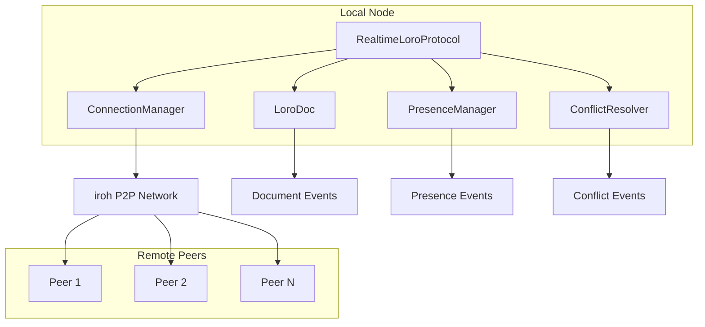
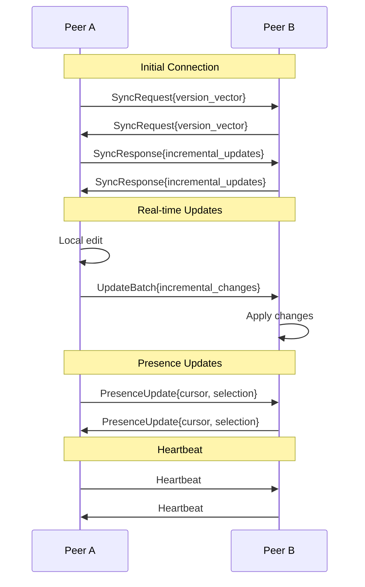
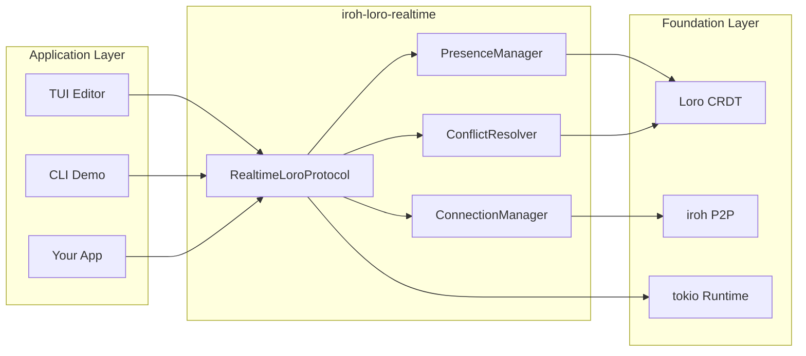
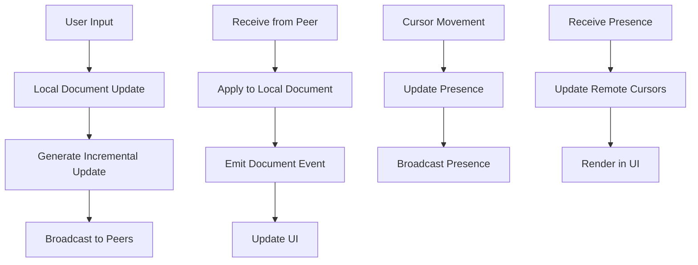
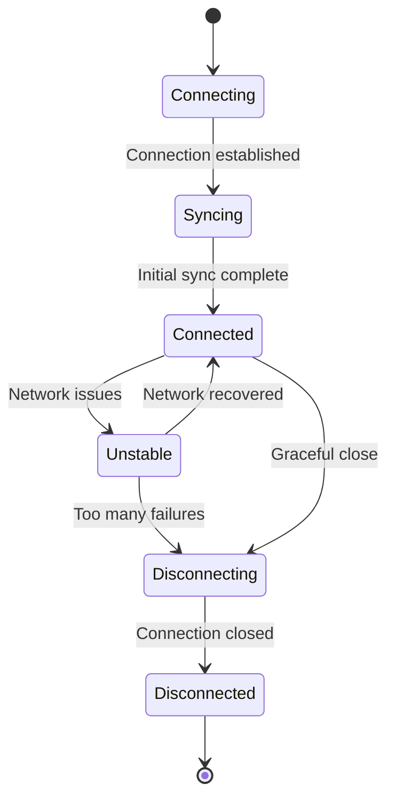

# Iroh-Loro Realtime

A real-time collaborative CRDT synchronization library using [Loro](https://loro.dev) and [iroh](https://iroh.computer) P2P networking.

## Overview

This library provides the foundation for building collaborative applications with:

- **Real-time document synchronization** - Changes propagate instantly to all connected peers
- **Presence awareness** - See other users' cursors, selections, and typing indicators  
- **Conflict resolution** - Automatic and manual handling of concurrent edits
- **Offline support** - Automatic reconnection and sync when back online
- **P2P networking** - No central servers required, direct peer-to-peer connections
- **CRDT-based** - Conflict-free replicated data types ensure consistency

## Architecture



## Core Components

### 1. RealtimeLoroProtocol
The main protocol handler that orchestrates all components:
- Manages peer connections and lifecycle
- Handles document synchronization
- Coordinates presence and conflict resolution

### 2. ConnectionManager
Manages P2P connections between peers:
- Maintains active peer connections
- Handles heartbeats and connection health
- Manages connection state transitions

### 3. PresenceManager
Tracks user presence and awareness:
- Cursor positions and selections
- Typing indicators
- User information and colors

### 4. ConflictResolver
Handles concurrent editing conflicts:
- Detects overlapping operations
- Provides automatic resolution strategies
- Supports manual conflict resolution

## Message Flow



## Quick Start

### Basic Usage

```rust
use iroh_loro_realtime::{RealtimeLoroProtocol, DocumentEvent, PresenceEvent};
use loro::LoroDoc;
use tokio::sync::broadcast;

#[tokio::main]
async fn main() -> anyhow::Result<()> {
    // Create Loro document
    let doc = LoroDoc::new();
    
    // Create event channels
    let (update_tx, mut update_rx) = broadcast::channel(100);
    let (presence_tx, mut presence_rx) = broadcast::channel(100);
    
    // Create user info
    let user_info = UserInfo {
        name: "Alice".to_string(),
        color: "#4ECDC4".to_string(),
        avatar_url: None,
    };
    
    // Create protocol
    let protocol = RealtimeLoroProtocol::new(
        doc,
        local_node_id,
        user_info,
        update_tx,
        presence_tx,
    ).await?;
    
    // Apply local changes
    protocol.apply_local_change(|doc| {
        let text = doc.get_text("main");
        text.insert(0, "Hello, collaborative world!")?;
        Ok(())
    }).await?;
    
    Ok(())
}
```

### TUI Editor Example

Run the collaborative TUI editor:

```bash
# Terminal 1 - Start first editor
cargo run --example tui_editor --features tui -- --name Alice --color "#FF6B6B"

# Terminal 2 - Connect second editor to first
cargo run --example tui_editor --features tui -- --name Bob --color "#4ECDC4" --connect <NODE_ID>
```

### Command Line Demo

Run the interactive demo:

```bash
# Terminal 1 - Start first node
cargo run --bin realtime-demo -- --name Alice

# Terminal 2 - Connect to first node
cargo run --bin realtime-demo -- --name Bob --connect <NODE_ID>
```

## Features

### Real-time Synchronization

Unlike the basic iroh-loro example which uses snapshot-based sync, this implementation provides:

- **Incremental updates**: Only changed data is transmitted
- **Persistent connections**: Real-time propagation of changes
- **Version vectors**: Efficient tracking of document state
- **Automatic reconnection**: Handles network interruptions gracefully

### Presence Awareness

Track and display user activity:

```rust
// Update cursor position
let cursor = CursorPosition::new(10, 5, "main".to_string(), 150);
protocol.presence_manager().update_cursor(cursor).await?;

// Update selection
let selection = Selection::new(start_cursor, end_cursor);
protocol.presence_manager().update_selection(Some(selection)).await?;

// Set typing indicator
protocol.presence_manager().set_typing(true).await?;
```

### Conflict Resolution

Handle concurrent edits intelligently:

```rust
// Automatic resolution for simple conflicts
let resolution = conflict_resolver.handle_concurrent_edits(&local_ops, &remote_ops).await?;

match resolution {
    ConflictResolution::AutoMerged => {
        // Conflict resolved automatically
    }
    ConflictResolution::RequiresUserInput { conflict_id } => {
        // Present conflict to user for manual resolution
        let conflict_info = conflict_resolver.get_conflict_info(&conflict_id).await;
        // ... show UI for resolution
    }
}
```

## Protocol Messages

The protocol defines several message types for different purposes:

### Document Synchronization
- `SyncRequest` - Initial version exchange
- `SyncResponse` - Incremental updates response  
- `UpdateBatch` - Real-time change propagation

### Presence Management
- `PresenceUpdate` - Cursor/selection changes
- `UserJoined` - New user in session
- `UserLeft` - User disconnected

### Connection Management
- `Heartbeat` - Keep-alive messages
- `ConflictNotification` - Conflict alerts

## Performance Characteristics

### Scalability
- **Small groups (2-10 users)**: Excellent performance
- **Medium groups (10-50 users)**: Good performance with proper batching
- **Large groups (50+ users)**: May require optimization strategies

### Network Efficiency
- **Incremental sync**: Only changed data transmitted
- **Compression**: Binary message encoding
- **Batching**: Multiple operations combined when possible

### Memory Usage
- **Document size**: Scales with content size
- **Peer connections**: ~1KB per active peer
- **Presence data**: ~100 bytes per user

## Comparison with Basic iroh-loro

| Feature | Basic iroh-loro | iroh-loro-realtime |
|---------|----------------|-------------------|
| Sync Model | Snapshot-based | Incremental |
| Connection | One-shot | Persistent |
| Real-time | No | Yes |
| Presence | No | Yes |
| Conflicts | Auto-merge only | Auto + Manual |
| Offline Support | Manual | Automatic |
| Performance | Good for occasional sync | Optimized for real-time |

## Use Cases

### Ideal For
- **Collaborative text editors** - Real-time document editing
- **Shared whiteboards** - Visual collaboration tools  
- **Code editors** - Pair programming environments
- **Note-taking apps** - Shared notebooks and wikis
- **Chat applications** - Real-time messaging with rich content

### Not Ideal For
- **Large documents** (>10MB) - Consider chunking strategies
- **High-frequency updates** (>100 ops/sec) - May need batching
- **Binary data** - Text-focused optimizations
- **One-way sync** - Basic iroh-loro is simpler

## Development

### Building

```bash
# Build library
cargo build

# Build with TUI features
cargo build --features tui

# Run tests
cargo test

# Run examples
cargo run --example tui_editor --features tui
cargo run --bin realtime-demo
```

### Testing

```bash
# Unit tests
cargo test

# Integration tests with multiple nodes
cargo test --test integration

# Performance benchmarks
cargo bench
```

## Architecture Diagrams

### Component Architecture



### Data Flow



### Connection Lifecycle



## Contributing

1. Fork the repository
2. Create a feature branch
3. Make your changes
4. Add tests for new functionality
5. Ensure all tests pass
6. Submit a pull request

## License

Licensed under either of:

- Apache License, Version 2.0 ([LICENSE-APACHE](LICENSE-APACHE))
- MIT License ([LICENSE-MIT](LICENSE-MIT))

at your option.
